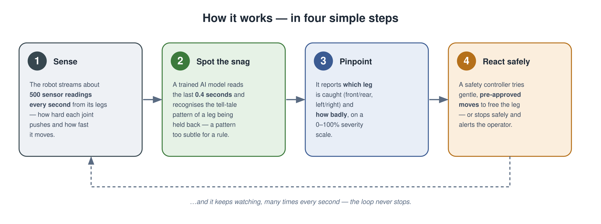
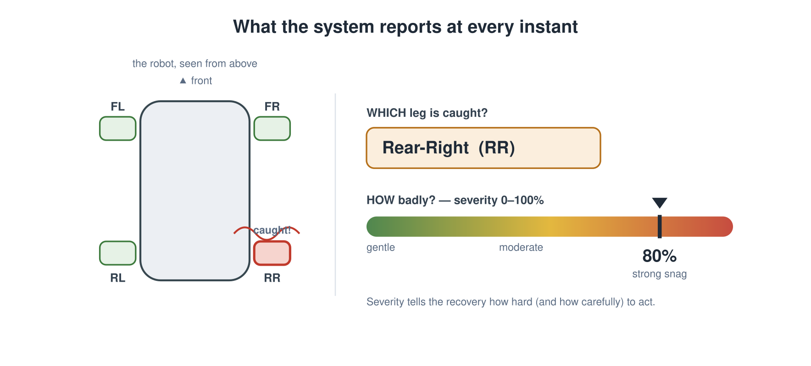
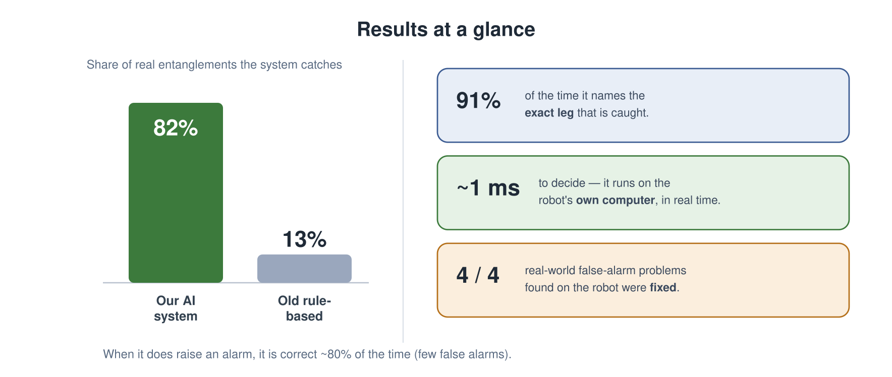
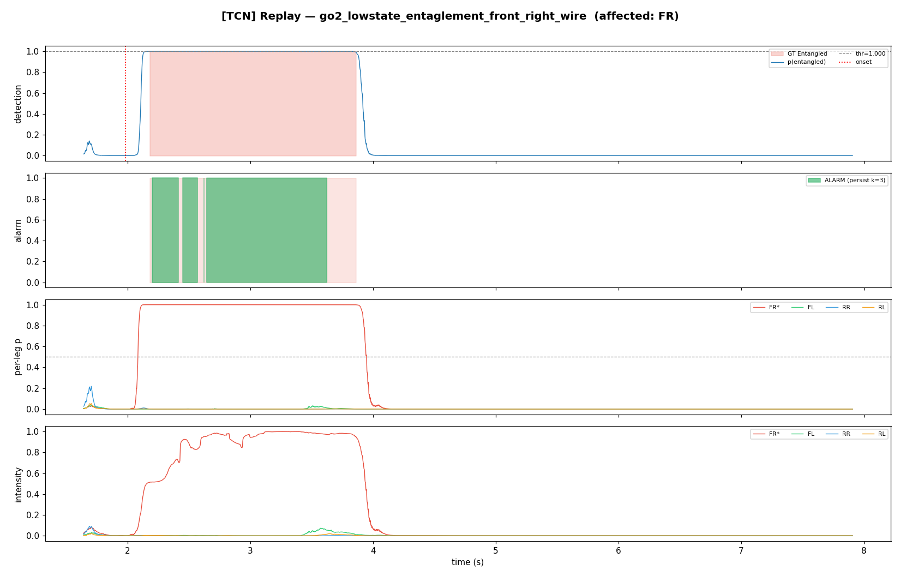

# Leg-Entanglement Detection & Recovery — Project Overview

*A plain-language summary for a non-technical reader.*

> **In one sentence:** we built software that lets a four-legged robot notice — in real
> time, from its own body sensors — when one of its legs gets caught on a wire, net, or a
> person's hand, tell **which** leg and **how badly**, and then attempt to free it safely.

---

## 1. The problem

Four-legged robots increasingly work in messy, real-world spaces: rooms with cables,
outdoor sites with netting or vegetation, or alongside people who might grab a leg. When a
leg gets **caught**, the robot keeps trying to walk and fights the obstacle — and within a
second or two it can stumble or fall. A fall means downtime, damage, and a safety risk.

Spotting this early is surprisingly hard:

- **Cameras don't help much.** Thin wires and clear fishing line are nearly invisible, and
  the robot's own body blocks the view of its legs.
- **A simple rule doesn't work.** The warning sign is subtle — a small, brief change in how
  hard a leg is straining — and it looks a lot like normal walking, standing, or the stiff
  pose the robot holds right after standing up. A single "if the force is above X" rule
  either misses real snags or cries wolf constantly.

So instead of a camera or a fixed rule, we use the robot's **own sense of touch** — the
hundreds of force and motion readings its legs already produce every second — and a small
**trained model** that has learned what a real snag looks like.

---

## 2. Our solution

The system runs as a continuous loop on the robot. It has four simple steps:

**Step 1 — Sense.** The robot already reports about **500 readings per second** from each
leg: how hard every joint is pushing and how fast it is moving, plus balance sensors.

**Step 2 — Spot the snag.** A trained **AI model** looks at the last **0.4 seconds** of
those readings and recognises the tell-tale pattern of a leg being held back.

> **In plain terms — what is the "AI model"?** Think of it like a pattern-recogniser that
> we *taught* by showing it many real examples: recordings where a leg was caught, and
> recordings of normal walking, standing, and stopping. It learned the difference on its
> own, so it can catch subtle cases a hand-written rule would miss. It only ever looks at
> the recent past, so it can run live on the robot.

**Step 3 — Pinpoint.** This is the part that makes the system genuinely useful. At every
instant it reports **which** leg is caught and **how badly**:

**Step 4 — React safely.** A separate **safety controller** takes that information and
tries gentle, pre-approved moves to free the leg — for example, shifting the robot's weight
off the trapped corner, or a small step backwards. If it can't free the leg, it stops the
robot safely and hands control to the operator. Crucially, this recovery ships **switched
off by default** and only logs what it *would* do, so it can be checked thoroughly before it
is ever allowed to move a real robot.

> **Why not just use the robot's cameras or a bigger AI?** We deliberately kept the model
> **small and fast** so it runs on the robot's own modest computer in about a thousandth of
> a second, with no extra hardware and no reliance on a network connection.

---

## 3. Results — and what's new

Measured carefully on held-out data the model had never seen during training:

- It **catches about 82%** of real entanglements — versus only **13%** for the older,
  rule-based approach on the same data.
- When it **does** raise an alarm, it is **correct about 80%** of the time (few false
  alarms).
- It names the **exact leg** correctly about **91%** of the time.
- It decides in about **1 millisecond** on the robot's own CPU — comfortably real-time.
- After the first on-robot trial we found **four** situations where it gave false alarms
  (e.g. right after standing up, or while walking backwards); by collecting a little more
  data and re-training, **all four were eliminated**.

### The two things that make this novel

Most prior work answers only a yes/no question — *"is a leg caught?"*. Our system adds two
capabilities that a recovery controller actually needs:

**a) The exact leg (not just "a leg").**
The model points to one of the four specific legs (front/rear, left/right). This is what
tells the recovery *where* to act. We measure this strictly: it must name **exactly** the
right leg(s), and it does so ~91% of the time.

**b) A severity score — "how badly" — from 0 to 100%.**
There are no ground-truth "severity" measurements to learn from, so we compute severity from
**physics**, combining two simple, intuitive signals for the flagged leg:

1. **Strain-without-motion** — how hard the leg is pushing while barely moving. A leg that
   pushes hard but goes nowhere is being held by *something*.
2. **How unusual the motion looks** — how far the leg's behaviour has drifted from what
   normal walking looks like.

These are blended into a single 0–100% score that sits near **0% during normal
walking/standing** and **rises smoothly as a snag gets worse**. The recovery uses it to
decide how hard, and how carefully, to act — gently for a light pinch, more cautiously for a
strong snag.

### The system in action

The picture below is a real recording of a front-right leg caught on a wire. When the snag
happens, all three outputs light up together — the alarm, the correct leg, and the severity
— and they fall back to zero the moment the leg is released. The other three legs stay quiet
throughout.

*Top to bottom: the alarm confidence, the alarm itself, which leg (front-right, in red), and
the severity — all rising at the snag and clearing at release.*

---

## 4. Safety by design

Because this software can, in principle, command a robot to move, safety is built in from
the start:

- **Off by default.** Recovery motion is disabled unless an operator explicitly turns it on;
  otherwise it only *logs* what it would do.
- **Only pre-approved moves.** It uses the robot manufacturer's own, documented motion
  commands — never arbitrary control — so the robot stays within its built-in balance limits.
- **Always a safe exit.** An emergency-stop makes the robot go limp instantly, and any
  fault or timeout falls back to that safe state automatically.
- **Detection is watch-only.** The detector itself never commands motion; it only reports.

---

## 5. Where we are, and what's next

**Proven so far (measured):** the detection accuracy, the exact-leg and severity outputs,
the real-time speed on the robot's CPU, and the elimination of the four field false-alarm
cases. The recovery decision-logic is also fully tested in simulation.

**Still to validate on the real robot (honest caveat):** whether the recovery *moves*
actually free a caught leg in practice — the exact directions and strengths of those moves
are sensible engineering choices, but they have **not yet been proven on hardware**. That is
why recovery ships switched off. The natural next step is a staged robot trial: detector
only → recovery in "log-only" mode → carefully supervised live recovery.

**Biggest opportunity:** collect more examples of the under-represented cases (especially
front-right snags), which is the single clearest way to push accuracy higher.

---

*Prepared as a non-technical overview. A full technical write-up (methods, metrics, and a
formal paper) is available in the project repository for the engineering team.*
